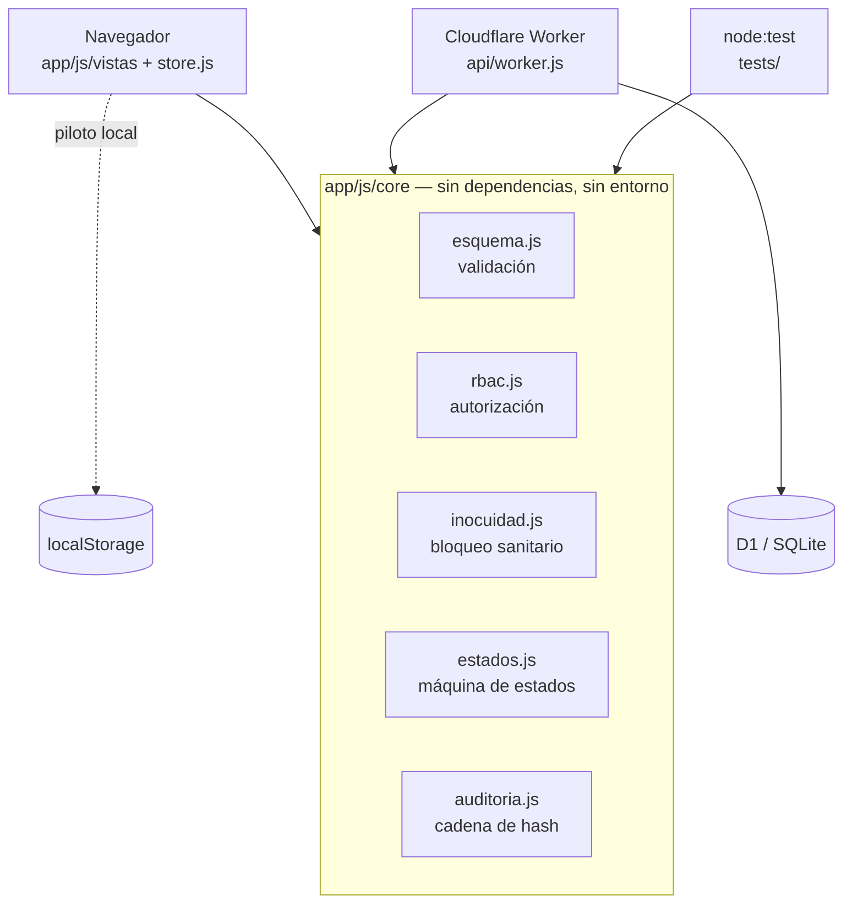
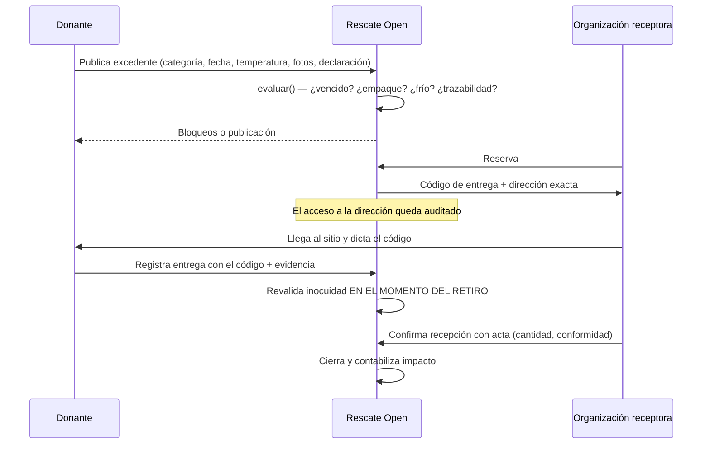

# Arquitectura

## La idea en una frase

Las reglas del piloto —qué se puede publicar, quién puede hacer qué y cómo se prueba que una entrega ocurrió— viven en un solo lugar, **`app/js/core/`**, que no sabe si corre en un navegador, en Node o en un Worker.

Consecuencia práctica: cuando un profesional de inocuidad diga "la ventana para preparados debe ser de 2 horas, no 4", se cambia **un número** en `app/js/datos/catalogos.js` y el cambio aplica al formulario del donante, a la validación del servidor y a las pruebas al mismo tiempo.

## Por qué sin framework y sin build

Es una decisión deliberada, no una limitación.

- **Se despliega copiando una carpeta.** Cualquier hosting estático sirve el piloto. Un proyecto que necesita coordinar organizaciones pequeñas no puede depender de que alguien mantenga una cadena de build.
- **El código que se audita es el código que corre.** Para un proyecto con implicaciones sanitarias y de datos personales, poder leer en el navegador exactamente lo que ejecuta el usuario tiene valor real.
- **Cero dependencias de terceros en ejecución.** No hay superficie de cadena de suministro que vigilar, ni actualizaciones urgentes por vulnerabilidades de paquetes que nadie leyó.
- **Módulos ES nativos.** El navegador los carga directamente; Node los ejecuta en las pruebas; Wrangler los empaqueta para el Worker.

El costo: no hay renderizado declarativo ni tipos. Se compensa con vistas pequeñas que se repintan enteras y con un núcleo cubierto por pruebas.

Si el proyecto migra a Next.js + TypeScript (ver `03-prompt-claude.md`), lo que debe sobrevivir intacto es el núcleo: traducirlo a TS es mecánico, redescubrir sus reglas no lo es.

## Las cuatro puertas

Ninguna donación cambia de estado sin cruzar, en este orden:

1. **Autorización** — `rbac.js` responde si el rol *y la pertenencia al recurso* permiten la acción. La respuesta por defecto es "no".
2. **Máquina de estados** — `estados.js` responde si la transición existe desde el estado actual. Los estados terminales no tienen salida, ni para ADMIN.
3. **Guardas** — inocuidad vigente, organización verificada, consentimiento vigente, código de entrega correcto, acta de recepción completa.
4. **Auditoría** — el evento se encadena por hash al anterior. También se auditan los intentos bloqueados.

La única función que puede saltarse una de estas puertas no existe, y ese es el punto: `aplicarTransicion()` es la única forma de cambiar `estado`.

## Flujo de una donación

Dos momentos merecen atención:

**La revalidación en la entrega.** Una donación apta al publicarse puede no serlo tres horas después. `evaluarParaEntrega()` vuelve a correr todas las reglas con la hora del retiro. Es el único punto donde el sistema puede detener un alimento que dejó de ser apto mientras esperaba.

**El código de entrega.** Lo genera el servidor cuando se reserva y solo lo ve la organización receptora. El donante lo necesita para registrar la entrega, así que solo puede obtenerlo de quien está físicamente ahí. No es criptografía: es una prueba de presencia.

## Qué se guarda y qué no

| Dato | Se guarda | Quién lo ve |
|---|---|---|
| Coordenadas exactas del retiro | **No.** Se redondean a una celda de ~1 km | nadie |
| Dirección textual de retiro | Sí | organización con reserva activa, soporte, administración |
| Teléfono de contacto en sitio | Sí | igual que la dirección |
| IP | Recortada a /24 (o /48) y seudonimizada con sal | nadie en claro |
| Documentos de verificación | Referencia y hash, no el archivo | verificación, con acceso auditado |
| Fotos de evidencia | Referencia | partes de la operación |

La proyección se hace en `donacion.js` (`vistaPublica` / `vistaParaReserva`), no en cada vista. Una prueba verifica que la vista pública no filtre ninguno de los campos reservados.

## Mapa de archivos

| Necesitas cambiar… | Ve a |
|---|---|
| Un rango de temperatura, una ventana, una categoría | `app/js/datos/catalogos.js` |
| Qué bloquea una publicación | `app/js/core/inocuidad.js` |
| Quién puede hacer qué | `app/js/core/rbac.js` |
| Los pasos del flujo | `app/js/core/estados.js` |
| Los campos de una donación | `app/js/core/donacion.js` + `api/schema.sql` |
| Textos de consentimiento y finalidades | `app/js/core/consentimiento.js` + `legal/` |
| Colores, tipografía, espaciado | `app/css/rescate.css` (bloque `:root`) |
| Ciudades del piloto | `app/js/core/geo.js` |
