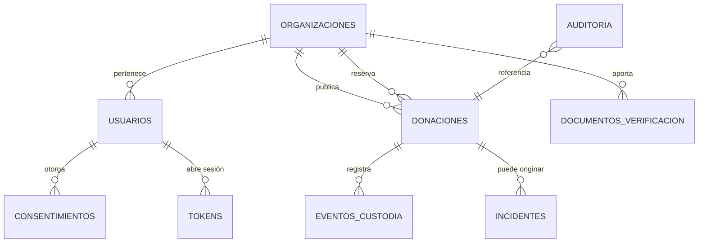

# Modelo de datos

Esquema SQL completo: `api/schema.sql`. Entidades en el núcleo: `app/js/core/donacion.js` y `organizacion.js`.

## Decisiones que están en el esquema, no en el código

Estas restricciones viven en la base de datos a propósito: si mañana alguien escribe un script de migración apurado, la base se defiende sola.

| Restricción | Qué impide |
|---|---|
| `CHECK (estado IN (...))` | Un estado inventado por un `UPDATE` manual |
| `CHECK (rol NOT IN ('VERIFIER','ADMIN') OR mfa_activo = 1)` | Que exista un administrador sin segundo factor |
| `CHECK (estado <> 'RESERVED' OR (reservada_por_id IS NOT NULL AND codigo_entrega IS NOT NULL))` | Una reserva sin organización o sin prueba de entrega |
| `CHECK (reservada_por_id <> organizacion_id)` | Que una organización se "done" a sí misma para inflar cifras |
| `CHECK (retiro_hasta > retiro_desde)` | Ventanas invertidas |
| `TRIGGER auditoria_sin_update / _sin_delete` | Editar o borrar historial, incluso con acceso directo a la base |
| `ON DELETE RESTRICT` en donaciones | Borrar una organización con historial de custodia |

## Campos sensibles y su tratamiento

| Campo | Clasificación | Regla |
|---|---|---|
| `direccion_exacta`, `contacto_nombre`, `contacto_telefono` | Reservado | Solo por reserva activa; nunca en el listado público |
| `lat_aprox` / `lon_aprox` / `celda` | Público | Redondeado a ~1 km. Las coordenadas exactas **no se almacenan** |
| `codigo_entrega` | Secreto operativo | Lo genera el servidor; solo lo ve quien reservó; se anula al liberar |
| `ip_seudonima` | Seudonimizado | /24 o /48, con sal. Nunca la IP completa |
| `hash_texto_mostrado` (consentimientos) | Probatorio | Permite demostrar qué texto vio el titular sin guardar una copia por usuario |
| `referencia_externa` (documentos) | Reservado | Clave en bucket cifrado, nunca una URL pública |
| `hash_token` | Secreto | Solo el hash: filtrar la tabla no filtra sesiones |

## Ciclo de vida y retención

`TODO (legal)`: los plazos siguientes son una propuesta de trabajo. Un abogado debe fijarlos según obligaciones contables, sanitarias y de protección de datos.

| Dato | Propuesta de retención | Razón |
|---|---|---|
| Donación cerrada y cadena de custodia | 5 años | Trazabilidad ante un incidente sanitario posterior |
| Documentos de verificación | Mientras la organización esté activa + 2 años | Prueba de diligencia en la admisión |
| Auditoría | 5 años | Investigación de fraude e incidentes |
| Consentimientos | Vigencia + plazo de prescripción | Debe poder probarse la autorización después de revocada |
| Cuenta de usuario inactiva | 24 meses → anonimizar | Minimización |
| `limites` (rate limiting) | 24 horas | No es un registro, es un contador |
| IP seudonimizada | Igual que el evento que la contiene | No tiene vida propia |

La columna `borrar_despues_de` en `documentos_verificacion` existe para que el calendario de retención sea un dato, no una nota en un documento que nadie lee.

## Sobre migrar a PostgreSQL + Prisma

`api/schema.sql` está escrito en SQLite (D1) pero pensado para traducirse:

- `TEXT` con fechas ISO 8601 → `TIMESTAMPTZ`
- `INTEGER` booleanos → `BOOLEAN`
- `*_json TEXT` → `JSONB`
- `CHECK (x IN (...))` → `ENUM` de PostgreSQL, que Prisma mapea directo
- Los disparadores anti-`UPDATE`/`DELETE` de auditoría se reescriben como reglas o como permisos de rol (`REVOKE UPDATE, DELETE ON auditoria`)

Deriva el `schema.prisma` de este archivo, no de cero: las restricciones de arriba son el resultado de decisiones sobre fraude y trazabilidad, y son fáciles de perder al reescribir.
