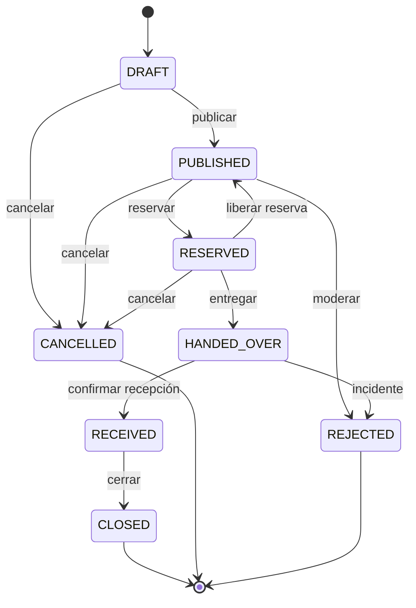

# Máquina de estados de la donación

Implementación: `app/js/core/estados.js` · Pruebas: `tests/estados.test.js`



## Tabla completa

| Desde | Hacia | Permiso | Guardas | Evento auditado |
|---|---|---|---|---|
| `DRAFT` | `PUBLISHED` | `donacion:publicar` | consentimiento vigente, donante verificado, **inocuidad** | `DONACION_PUBLICADA` |
| `DRAFT` | `CANCELLED` | `donacion:cancelar` | motivo ≥ 10 caracteres | `DONACION_CANCELADA` |
| `PUBLISHED` | `RESERVED` | `reserva:crear` | receptor verificado, consentimiento, sin reserva previa, **inocuidad** | `DONACION_RESERVADA` |
| `PUBLISHED` | `CANCELLED` | `donacion:cancelar` | motivo | `DONACION_CANCELADA` |
| `PUBLISHED` | `REJECTED` | `donacion:moderar` | motivo | `DONACION_RECHAZADA_MODERACION` |
| `RESERVED` | `PUBLISHED` | `reserva:liberar` | reserva activa, motivo | `RESERVA_LIBERADA` |
| `RESERVED` | `HANDED_OVER` | `entrega:registrar` | reserva activa, **código de entrega**, **inocuidad revalidada**, evidencia | `DONACION_ENTREGADA` |
| `RESERVED` | `CANCELLED` | `donacion:cancelar` | motivo | `DONACION_CANCELADA` |
| `HANDED_OVER` | `RECEIVED` | `recepcion:confirmar` | reserva activa, acta de recepción | `DONACION_RECIBIDA` |
| `HANDED_OVER` | `REJECTED` | `donacion:moderar` | motivo | `DONACION_RECHAZADA_INCIDENTE` |
| `RECEIVED` | `CLOSED` | `custodia:cerrar` | — | `DONACION_CERRADA` |

`CLOSED`, `CANCELLED` y `REJECTED` no tienen transiciones de salida. Una prueba lo verifica recorriendo todos los destinos posibles con un actor `ADMIN`: si alguien añade una salida desde un estado terminal, la suite falla.

## Dos transiciones que no están en la especificación original

La especificación describía el camino feliz más `CANCELLED` y `REJECTED`. La operación real necesita dos salidas más, y quedan documentadas aquí porque son decisiones, no descuidos:

**`RESERVED → PUBLISHED` (liberar reserva).** Una organización que reservó y no alcanza a recoger debe poder devolver la donación al listado antes de que se pierda. Sin esta transición, la única salida sería cancelar, y el alimento se perdería por un problema de logística. Exige motivo escrito, borra la reserva y **anula el código de entrega** — el siguiente receptor recibe uno nuevo.

**`HANDED_OVER → REJECTED` (incidente).** Si entre la entrega y la confirmación aparece un problema sanitario, soporte o administración deben poder detener la operación. Solo con motivo escrito, y el estado terminal deja constancia de que el lote no debe consumirse.

## Guardas, una por una

| Guarda | Qué exige | Por qué |
|---|---|---|
| `consentimientoVigente` | Autorización de tratamiento de la versión actual | Sin autorización probada no hay tratamiento lícito |
| `donanteVerificado` / `receptorVerificado` | Organización `VERIFICADA` y no suspendida | El piloto opera solo con organizaciones constituidas |
| `inocuidadApta` | Cero bloqueos de `inocuidad.js` | Ley 1990 de 2019 como regla de producto |
| `inocuidadAptaEnEntrega` | Lo mismo, **reevaluado con la hora del retiro** | Lo apto al publicar puede no serlo al entregar |
| `sinReservaActiva` | La donación no está reservada | Evita doble compromiso sobre el mismo lote |
| `hayReservaActiva` | Existe reserva | No se entrega lo que nadie reservó |
| `codigoEntregaValido` | Código que dicta quien recibe | Prueba de presencia física en el retiro |
| `evidenciaEntrega` | Foto + nombre de quien recibe | Trazabilidad del momento de la entrega |
| `actaRecepcion` | Cantidad recibida y, si no es conforme, observaciones | La cantidad real casi nunca es la publicada |
| `motivoObligatorio` | Texto ≥ 10 caracteres | Un motivo vacío en auditoría no sirve de nada |

## Contrato de uso

```js
import { aplicarTransicion, ESTADOS } from "./core/estados.js";

const r = aplicarTransicion({
  donacion,                 // objeto actual
  a: ESTADOS.PUBLISHED,     // destino
  actor,                    // {id, rol, organizacionId, mfa, suspendido}
  contexto: {
    ahora: new Date(),
    consentimientoVigente: true,
    organizacionDonante,
    organizacionReceptora,
    motivo, codigoEntrega, evidencia, acta,
  },
});

if (!r.ok) {
  // r.codigo, r.mensaje, r.detalle (bloqueos sanitarios)
} else {
  // r.donacion  → nueva versión, la entrada NO se muta
  // r.evento    → listo para la cadena de auditoría
}
```

`evaluarTransicion()` responde lo mismo sin producir cambios: sirve para decidir qué botones mostrar. La interfaz lo usa en `app/js/vistas/detalle.js` — así nunca se ofrece una acción que el núcleo va a rechazar.

## Cómo se rompe (y por qué las pruebas importan)

La forma más común de romper una máquina de estados es "temporalmente" — un `donacion.estado = "PUBLISHED"` en una función auxiliar para arreglar un caso. A partir de ahí, la donación circula sin guardas sanitarias, sin auditoría y sin autorización.

Por eso el contrato es explícito: **si un archivo asigna `.estado` fuera de `aplicarTransicion()`, es un bug de seguridad**, aunque el resultado se vea correcto en pantalla. La revisión de PR debería buscar exactamente eso:

```bash
# Asignaciones a .estado (no comparaciones) fuera de la máquina de estados.
# Debe devolver cero líneas.
grep -rnE "\.estado\s*=[^=]" app/js api --include="*.js" | grep -v "core/estados.js"
```
